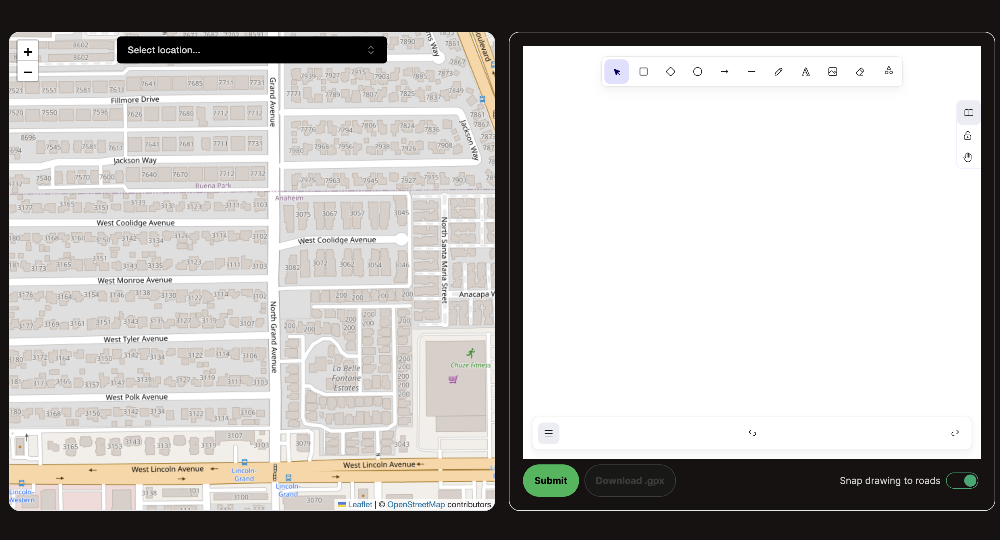

# LAMaps

A creative way to spice up your travelling!

Draw an image and it will be replicated in a location of your choosing on the
map. You can then download a file containing this route and use it in your
own maps applications.

This web application was built with Next.js and FastAPI.

## Inspiration
Millions of people go on walks every day. But how do they decide where to go? Some may struggle with finding out how to make their walking routines exciting and need a flash of inspiration. With LAMaps, there's no need to struggle! With a few simple strokes, our application can generate a route that users can download and follow as part of their daily routine.

## What it does
Users can draw simple images on a canvas. When submitted, the user will be able to see the drawing superimposed onto roads within a certain section of the map as a route they can follow. If they so wish, the user can download a file containing the route so they can import it into maps-related applications on their phone and be able to traverse the route themselves. This encourages them to go outside and do some exercise!

## How we built it

### Frontend
We built the frontend with [Next.js App Router](https://nextjs.org/). The map and drawing tool functionality are provided by [React Leaflet](https://react-leaflet.js.org/) and [Excalidraw](https://docs.excalidraw.com/) respectively. We used these tools because they were open source and provided extensive documentation on how to use their libraries.

### Backend
We built the backend with [FastAPI](https://fastapi.tiangolo.com/), a well-known Python framework for constructing website backends. We created routes that process the drawings provided by a user in Excalidraw and provides a list of coordinates in latitude and longitude through a complex algorithm that represent the drawing superimposed onto roads within a certain area of a map.

## Challenges we ran into
One of the most challenging parts of this project was developing the algorithm that generates the list of coordinates. In order to do this, we needed to have a strong understanding of image processing, using algorithms to find a path from the start to the end of the image, and geography to be able to translate the path to coordinates. We used OpenCV to process the image and several graph algorithm libraries that eventually helped us generate the coordinates.

## Accomplishments that we're proud of
We are proud of our image processing and UI. Processing user drawings required viewing the image as a graph. To accomplish this, we implemented image processing algorithms to get the representation. This allowed us to then use the Chinese postman algorithm to provide the user with a valid traversal of the graph Additionally, we are proud of our UI as it includes complicated components such as react-leaflet and Excalidraw. 

## What we learned
We learned a lot about the practical application of graph algorithms. When working on image processing for a user-specified drawing, we implemented a version of the Chinese postman problem so that the user could run the route without having to skip to different locations. Additionally, we learned a lot about how geographical data is stored and manipulated through tools such as networkx and geopandas.

## What's next for LAMaps
- Allowing users to save their drawings
- Integrating accounts with Maps applications (i.e. Google Maps, Apple Maps)

